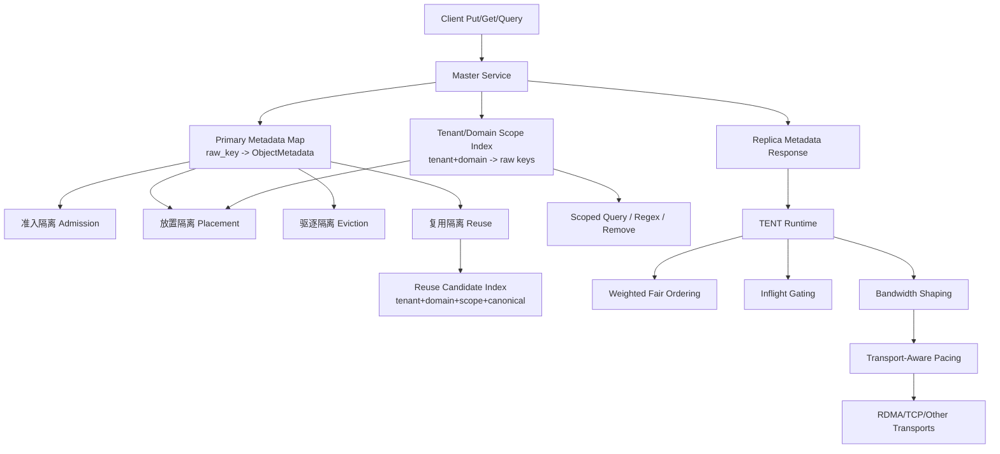
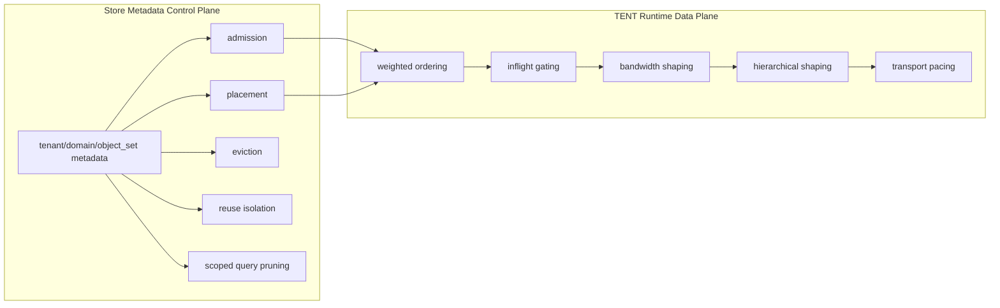
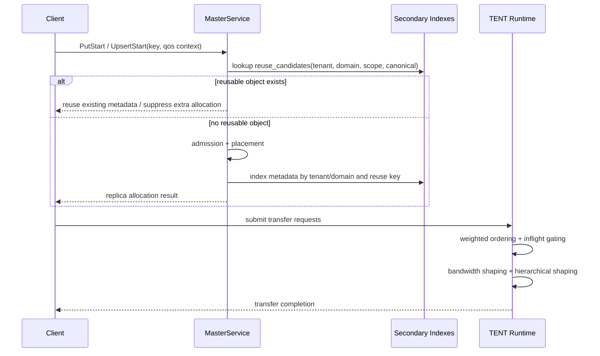

# Mooncake 多租隔离总体设计

## 文档状态

本文档给出 Mooncake 当前分支上的**完整多租隔离方案**。它不是只讨论 reuse，也不是只讨论 TENT 带宽整形，而是把当前已经实现的多租能力与下一阶段要补齐的 reuse 隔离统一放到同一个分层架构里描述。

当前可以把 Mooncake 的多租隔离理解为一个从 metadata 到数据面的分层体系：

- **身份层**：定义 tenant/domain/object_set 等隔离边界
- **准入层**：决定谁可以继续消耗容量
- **放置层**：决定对象应该落到哪里
- **驱逐层**：决定压力下先淘汰谁
- **执行层**：决定谁先进入运行时执行队列
- **带宽层**：决定谁真实占用多少传输带宽
- **复用层**：决定谁可以复用已有对象或已有 metadata 结果

其中，前 6 层已经在当前分支上有了实质性落地；第 7 层 reuse isolation 还需要进一步补齐。

---

## 1. 背景与问题

Mooncake Store 和 TENT Runtime 当前已经在对象 metadata 与请求 metadata 中携带了丰富的多租上下文：

- `tenant_id`
- `domain_id`
- `object_set`
- `sharing_scope`
- `qos_tier`
- `logical_key`
- `canonical_key`
- `tenant_shares`

这些字段已经不再只是“透传标签”，而是开始真正参与：

- admission
- placement
- eviction
- weighted scheduling
- inflight gating
- bandwidth shaping

但是当前系统还存在两个明显问题：

### 问题 1：reuse 边界还不够显式

当前 metadata 中已经具备定义复用边界所需的信息，但系统还没有把“什么情况下才允许复用已有对象”做成一条显式规则。

这会带来两个风险：

- **正确性风险**：后续代码演进时，可能无意中允许跨 tenant 或跨 domain reuse
- **语义风险**：reuse 语义隐藏在局部逻辑里，而不是作为一层独立隔离策略存在

### 问题 2：metadata 查询还缺 tenant/domain 剪枝

Mooncake 的主 metadata 目前仍然按 raw object key 做 primary shard 和主索引。精确 `GetReplicaList(key)` 本身已经很快，这不是主要问题。

问题在于一些更宽范围的 metadata 路径仍然会做较大范围遍历，例如：

- shared-object admission lookup
- preferred-segment locality lookup
- regex query
- bulk key listing
- regex remove

这些路径其实已经知道 tenant/domain 信息，但还没有利用它们来先剪枝。

---

## 2. 设计目标

本文档对应的多租隔离总体目标是：

1. 把多租隔离做成**显式、分层、可解释**的体系，而不是零散 patch
2. 保持 raw-key exact lookup 的性能不退化
3. 保证跨 tenant / 跨 domain 默认不能复用对象
4. 让 query / regex / locality 等 metadata 路径能够按 tenant/domain 先剪枝
5. 保证公平性不以牺牲总吞吐为代价
6. 与 snapshot/restore、HA 恢复流程兼容

---

## 3. 非目标

本轮设计明确**不做**以下事情：

- 不重做 primary metadata shard 布局
- 不把所有策略都下沉到 transport backend
- 不引入全局 metadata 大锁
- 不试图让 regex / 全量管理接口变成零成本
- 不要求第一版就做全量 locality 聚合索引

---

## 4. 多租隔离的分层模型

## 4.1 第 0 层：身份与命名隔离层

这是整个多租隔离体系的基础层，负责定义“对象属于谁、处在哪个子空间、是否允许共享”。

当前关键字段：

- tenant 维度：`tenant_id`
- 子域维度：`domain_id`
- 更细粒度对象组：`object_set`
- 共享边界：`sharing_scope`
- 逻辑对象名：`logical_key`
- 规范对象名：`canonical_key`

作为向 namespace-native metadata 演进的第一步，store 现在已经有了显式 identity helper：

- `LogicalObjectId = { tenant_id, domain_id, object_set, logical_key }`
- `ReuseIdentity = { tenant_id, domain_id, sharing_scope, canonical_key }`

其中 `BuildLogicalObjectId(raw_key, config)` 统一了当前的 fallback 规则：如果调用方没有显式给 `logical_key`，就用 raw key 作为 logical key；`BuildCanonicalObjectKey(...)` 则在调用方未显式提供 `canonical_key` 时，基于 logical identity 生成 canonical identity。

这一层解决的问题是：

- tenant 之间的对象命名空间不再天然混在一起
- domain/object_set 可以成为后续 placement、reuse、hierarchy shaping 的边界键

---

## 4.2 第 1 层：准入隔离（Admission Isolation）

准入层负责回答一个问题：

> 一个新请求是否允许继续消耗集群容量？

### 当前已实现能力

在当前分支上，store metadata 已经进入 tenant-aware admission 路径：

- tenant QoS policy 会参与 admission
- shared-object 场景下，已有对象可抑制重复分配
- admission 不再只是按 size 做统一判断，而是可以感知 tenant policy

### 这一层解决的问题

- 防止单个 tenant 无限制吞掉容量
- 把 tenant policy 前移到资源入口，而不是等到后面再补救
- 为后续 placement / eviction / reuse 建立第一道边界

---

## 4.3 第 2 层：放置隔离（Placement Isolation）

放置层负责回答：

> admitted 的对象应该落到哪些 segment / node 上？

### 当前已实现能力

当前分支上，placement 已经进入 tenant-aware 和 scope-aware 状态：

- tenant policy 会影响 placement
- `domain_id` / `object_set` 会影响 preferred segment 选择
- placement 不再是完全全局、完全扁平的 free-space 决策

### 这一层解决的问题

- 避免所有对象只按全局剩余空间随机落点
- 让 domain/object_set 的 locality 目标能够体现在放置决策里
- 减少不同 tenant/domain 在放置上的无差别竞争

---

## 4.4 第 3 层：驱逐隔离（Eviction Isolation）

驱逐层负责回答：

> 当容量紧张时，优先驱逐谁？

### 当前已实现能力

当前分支已经把 eviction 从纯全局策略推进到 tier-aware / tenant-aware：

- eviction 会观察 `qos_tier`
- tenant metadata 已进入 eviction 语义
- 更低优先级对象会比更高优先级对象更先成为候选

### 这一层解决的问题

- 避免所有对象在驱逐时完全平权
- 防止高价值 tenant 数据与低价值数据在压力下做无差别竞争
- 让 QoS tier 成为真正的资源保护手段

---

## 4.5 第 4 层：执行隔离（Execution Isolation）

执行隔离发生在 TENT runtime，负责回答：

> 请求进入数据面执行时，谁先执行、谁能占多少执行槽位？

### 当前已实现能力

TENT runtime 当前已经具备以下多租执行隔离能力：

- request normalization 把 QoS context 带入 runtime
- weighted-fair ordering 基于 `tenant_shares` 进行排序
- per-tenant inflight gating 控制单 tenant 并发执行数
- pending queue drain 保持 contention 下的 tenant-aware 公平性

### 这一层解决的问题

- 防止单 tenant 占满 runtime 执行槽位
- 把“谁先跑”与“谁占多少容量”区分开
- 为带宽整形提供上游排队与并发边界

---

## 4.6 第 5 层：带宽隔离（Bandwidth Isolation）

带宽隔离同样发生在 TENT runtime，负责回答：

> 每个 tenant 或 hierarchy scope 在单位时间内真实能占多少带宽？

### 当前已实现能力

当前分支上，这一层已经有了实质性落地：

- runtime-owned bandwidth shaping
- 基于 chunk 的 admission 与 fragment 推进
- burst / interval / min/max chunk 控制
- adaptive shaping
- closed-loop control
- hierarchical shaping：`tenant/domain/object_set`
- transport-aware pacing hint
- RDMA endpoint post wave limiting
- lone-active bypass
- work-conserving fairness

### 这一层解决的问题

- 把隔离从“顺序公平”推进到“真实带宽公平”
- 保证 contention 下 tenant 之间不会互相压垮
- 同时保证公平不会以牺牲总吞吐为代价

### 关键原则

这一层遵循两条硬约束：

1. **单租户独占时默认不应被限速**
2. **公平不能让总带宽闲置**

---

## 4.7 第 6 层：复用隔离（Reuse Isolation）

复用隔离负责回答：

> 一个对象或 metadata 结果是否允许被另一个请求直接复用？

这是当前多租隔离体系里**尚未完整实现**的一层。

### 当前状态

当前 metadata 已经有了定义复用边界所需的字段，但还缺：

- 显式 reuse eligibility policy
- reuse secondary index
- tenant/domain scoped query pruning

### 为什么 reuse 隔离是独立一层

因为 reuse 和 admission / placement / eviction / bandwidth 是不同的问题：

- admission 解决“能不能写进去”
- placement 解决“写到哪里”
- eviction 解决“先删谁”
- execution/bandwidth 解决“谁先传、谁传多少”
- **reuse 解决“已有对象能不能被另一个 namespace 直接借用”**

如果这一层缺失，那么系统虽然已经能做调度公平和资源公平，但对象身份边界仍然是不完整的。

---

## 5. reuse 隔离的推荐策略

推荐把 reusable object 的边界定义为：

只有以下条件同时满足，才允许把已有对象当作 reuse candidate：

- `tenant_id` 相同
- `domain_id` 相同
- `sharing_scope == "tenant_shared"`
- `canonical_key` 非空
- `canonical_key` 相同
- 对象至少有一个 completed replica

也就是说：

- **不同 tenant -> 不可复用**
- **同 tenant 不同 domain -> 不可复用**
- **非 tenant_shared -> 不可复用**
- **canonical_key 不同 -> 不可复用**

即便 `canonical_key` 当前可能已经编码了 tenant/domain/object_set，也仍然建议 reuse key 显式包含：

```text
tenant_id + domain_id + sharing_scope + canonical_key
```

这样后续即使 canonical key 构造规则演进，也不会把隔离边界变成隐式假设。

---

## 6. metadata 查询性能问题与剪枝思路

## 6.1 当前不是所有 query 都慢

需要先区分两类路径：

### 精确 raw-key lookup

例如：

- `GetReplicaList(key)`
- `ExistKey(key)`

这类路径当前已经是 O(1) shard lookup + per-object replica scan，不是主要瓶颈。

### 宽范围 metadata 路径

真正的问题路径在：

- shared-object admission lookup
- preferred-segment locality lookup
- regex query
- key listing
- regex remove

这些路径当前会遍历不必要的 metadata 范围。

## 6.2 需要 tenant/domain 剪枝

如果 query 已经知道：

- `tenant_id`
- `domain_id`

那就应该先拿 tenant/domain 范围内的候选 key，而不是继续扫整个 shard 或所有 shard。

---

## 7. 二级索引方案

推荐方案不是重做 primary metadata 布局，而是：

> 保留 raw-key 主索引，在 `MasterService::MetadataShard` 内增加 per-shard secondary indexes。

## 7.1 为什么用 per-shard secondary index

原因：

- 与现有锁模型一致
- 不引入全局锁
- raw-key exact lookup 不受影响
- 插入/删除可以在 shard 锁内增量维护
- restore 后可以自然 rebuild

## 7.2 推荐索引

### 索引 1：tenant/domain 候选 key 索引

```text
(tenant_id, domain_id) -> set<raw_key>
```

用途：

- scoped key listing
- scoped regex query
- scoped regex remove
- locality lookup 剪枝

### 索引 2：reuse candidate 索引

```text
(tenant_id, domain_id, sharing_scope, canonical_key) -> set<raw_key>
```

用途：

- shared-object admission lookup
- reuse eligibility lookup
- reuse isolation enforcement

### 索引 3：可选的 locality 聚合索引（后续）

```text
(tenant_id, domain_id, object_set) -> segment hit counts
```

第一版可以先不做这一层，只用 tenant/domain 候选 key 先剪枝，再按 `object_set` 过滤并统计 segment 命中。

---

## 8. 总体架构图



---

## 9. 控制面与数据面的职责划分



这个图表达的核心是：

- **Store metadata 控制面**负责身份、准入、放置、驱逐、reuse、query 剪枝
- **TENT 数据面**负责执行顺序、公平性、并发隔离和真实带宽控制

二者共同组成完整的多租隔离体系。

---

## 10. 带 reuse 的 metadata 处理流程



---

## 11. 当前分支已经实现了什么

## 11.1 Store 侧

当前分支已经实现：

- tenant QoS context 进入 object metadata
- admission 感知 tenant policy
- placement 感知 tenant/domain/object_set 语义
- tier-aware eviction
- domain/object_set locality 参与 preferred-segment 决策
- master 内存 metadata 主表已经切换为以 `LogicalObjectId` 为主键
- 旧 raw key 通过 alias 映射继续兼容，因此现有 key-based API 在迁移期仍可工作

## 11.2 TENT runtime 侧

当前分支已经实现：

- weighted-fair ordering
- per-tenant inflight gating
- runtime-owned bandwidth shaping
- adaptive shaping
- closed-loop control
- hierarchical shaping（`tenant/domain/object_set`）
- runtime pacing hint 与 RDMA endpoint 限流

## 11.3 还未完整实现的部分

还未完整补齐的是：

- reuse isolation
- tenant/domain secondary index
- scoped metadata query / regex / remove

---

## 12. 后续 reuse 开发方案

## 12.1 增加 shard-local secondary indexes

在 `MetadataShard` 内增加：

- tenant/domain 候选 key 索引
- reuse candidate 索引

primary map 保持：

```text
raw_key -> ObjectMetadata
```

## 12.2 统一索引维护 helper

所有 metadata 的 insert / erase / restore 都必须走统一 helper：

- insert 时建索引
- erase 前删索引
- restore 后 rebuild 索引

## 12.3 重写 reuse eligibility lookup

把当前 shared-object admission lookup 从“扫全量 metadata”改成：

1. 构造 reuse key
2. probe 每个 shard 的 reuse index
3. 只验证命中的候选 key

## 12.4 重写 locality lookup

把 locality lookup 改成：

1. 先按 `(tenant_id, domain_id)` 找候选 key
2. 再按 `object_set` 过滤
3. 只统计这部分对象的 replica segment 命中

## 12.5 增加 scoped metadata query 能力

优先支持：

- `GetAllKeysByScope(tenant_id, domain_id)`
- `GetReplicaListByRegexInScope(regex, tenant_id, domain_id)`
- `RemoveByRegexInScope(regex, tenant_id, domain_id, force)`

---

## 13. 关键文件

### Store metadata 与控制面

- `mooncake-store/include/master_service.h`
- `mooncake-store/src/master_service.cpp`
- `mooncake-store/include/replica.h`
- `mooncake-store/src/utils.cpp`
- `mooncake-store/include/utils.h`
- `mooncake-store/src/rpc_service.cpp`
- `mooncake-store/src/master_client.cpp`
- `mooncake-store/src/client_service.cpp`

### TENT 数据面隔离

- `mooncake-transfer-engine/tent/include/tent/runtime/qos_scheduler.h`
- `mooncake-transfer-engine/tent/src/runtime/qos_scheduler.cpp`
- `mooncake-transfer-engine/tent/include/tent/runtime/transfer_engine_impl.h`
- `mooncake-transfer-engine/tent/src/runtime/transfer_engine_impl.cpp`
- `mooncake-transfer-engine/tent/src/transport/rdma/endpoint.cpp`

### 测试与验证

- `mooncake-store/tests/master_service_test.cpp`
- `mooncake-transfer-engine/tent/tests/qos_scheduler_test.cpp`
- `mooncake-transfer-engine/tent/tests/qos_runtime_gating_test.cpp`
- `mooncake-transfer-engine/tent/tests/transfer_engine_config_override_test.cpp`

---

## 14. 风险与取舍

### 正确性风险

- metadata erase 路径漏删索引
- snapshot restore 后忘记 rebuild index
- reuse key 维度不完整导致跨 domain 串用
- locality 统计把不可用 replica 也当成有效证据

### 性能取舍

- raw-key exact lookup 保持不变
- 广义 query 仍然比 exact lookup 贵，但可以显著被 tenant/domain 剪枝
- 第一阶段优先降低实现风险，不急着做最复杂的 locality 聚合索引

---

## 15. 验证策略

## 15.1 reuse correctness

- 同 tenant + 同 domain + `tenant_shared` + same canonical key -> 可复用
- 不同 tenant -> 不可复用
- 同 tenant 不同 domain -> 不可复用
- 非 `tenant_shared` -> 不可复用
- 空 canonical key -> 不可复用

## 15.2 scoped query correctness

- scoped list 只返回指定 tenant/domain 的 key
- scoped regex 只在指定 tenant/domain 内匹配
- scoped remove 不影响其他 tenant/domain 对象

## 15.3 restore correctness

- restore 后 secondary index 被正确 rebuild
- restore 后 reuse isolation 仍然正确
- restore 后 scoped query 结果仍正确

## 15.4 TENT no-regression

- shaping 关闭时 weighted ordering 行为不回退
- shaping 关闭时 inflight gating 行为不回退
- runtime shaping 继续满足 lone-active bypass 与 work-conserving fairness

---

## 16. 总结

Mooncake 当前的多租隔离已经不再是单点能力，而是一套**完整的分层架构**：

1. 身份隔离
2. 准入隔离
3. 放置隔离
4. 驱逐隔离
5. 执行隔离
6. 带宽隔离
7. 复用隔离

其中：

- 前 6 层已经在当前分支上形成了实质能力
- 第 7 层 reuse isolation 是下一步要补齐的关键缺口

当 reuse isolation 和 tenant/domain metadata 剪枝补齐之后，Mooncake 的多租隔离就会从“资源调度公平”进一步升级为“对象身份、资源分配、执行过程、复用边界”四个维度统一闭环。